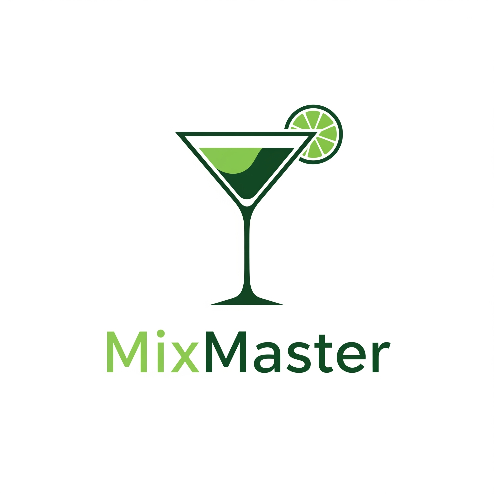

<br />
<div align="center">
  <a href="https://github.com/oshriagronov/mix-master">
    
  </a>
<h3 align="center">MixMaster</h3>
  <p align="center">
    The ultimate party sidekick app that fetches cocktails from the hilarious Cocktails DB API
  </p>
</div>

## About

The project is a is a site that fetches cocktails from "The Cocktails DB API", The site allows users to search for cocktails by name or category, and then view detailed information about each cocktail, including its ingredients, instructions, and photos
### Key features

  - Search for cocktails.
  - Support cashing.
  - Detailed page about every cocktail.


## Technologies Used

- JavaScript, HTML, CSS.
- React - React Router, React query, Axios.
- The Cocktails DB API.
- Vite


## Getting Started

To get a local copy up and running follow these simple steps.

### Prerequisites

- Linux, MacOS or Windows
- npm
- nodejs

### Installation
---

1. **Clone and enter the Magnetron repository:**

   ```bash
   git clone https://github.com/oshriagronov/mix-master && cd mix-master
   ```

2. **Install npm moudles**  

   ```bash
   sudo npm i
   ```

3. **Run the app**
    ```bash
    npm run dev
    ```
4. **Go to the site**
   <br/>_Finally, the site runs in the development mode, open [http://localhost:5173](http://localhost:5173/) to view it in your browser._


## Acknowledgements

I would like to thank John Smilga for creating the great course "Complete React, Next.js & TypeScript Projects Course 2024" and for providing the data through "The Cocktails DB".

> Link to the course [here](https://www.udemy.com/course/react-tutorial-and-projects-course/?couponCode=KEEPLEARNING) <br> Link to the The Cocktail DB [here](https://www.thecocktaildb.com/api.php)
